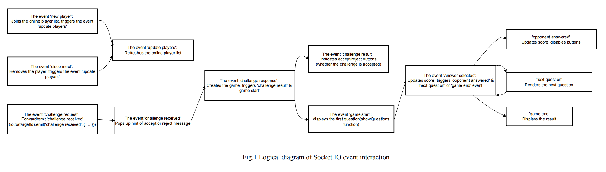

# Project Report
ZHOU HONGYI

## The overall design of the Website and Quiz Application

### The structure

The structure of the Website includes three display pages (`index.html`, `about.html` and `welcomeQuiz.ejs`), where JavaScript file (`quiz.js`) is used to dynamically update the content of the pages and process users’ input, like the challenger’s name and the selected answers. And the `index.html` includes a brief introduction of myself, `about.html` includes a detailed introduction about myself, and the `welcomeQuiz.ejs` and `quiz.js` include the game logic.

The project file structure of this website is shown as follows:

**Root Directory**

- `assets/`
  - `figure-1-logical-diagram.png`
- `node_modules/`
- `public/`
  - `about.html`
  - `index.html`
  - `photo.png`
  - `project.css`
- `views/`
  - `welcomeQuiz.ejs`
- `package-lock.json`
- `package.json`
- `quiz.js`
- `README.md`

## The design style

In terms of the design, this website features a carefully crafted blue-green color palette(The inspiration originated from website[1] or e-books[2]), creating a harmonious and modern aesthetic, where the buttons and the banner at the top of the web-page are both use this style of color among different pages, making sure that the design styles of different pages of this project remain consistent.

## The communication between clients and server

‘Express’ and ‘Socket.io’ are utilized in this project. Especially in realizing the function of challenge and quiz, multiple events are set to differentiate various methods to process the actions. Specifically, server-side uses Express framework, EJS rendering and communication by Socket.io, emitting events and updating information. And the client-side also uses Socket.io library and builds the connection with server. Before coding, I tried to read the book[3], [4] that is relevant to this area, so that I can have more abundant baisc knowledge to achieve functions.

As is required in Programming Assignment Document, the entire process of quiz can be concluded as “add new player -- challenge request -- challenge response --(if accepts) game start -- answer selected -- next question ...-- game end”. For the usage of Socket.io, in this project, it is used to send messages in a targeted manner (such as `io.to(socketId)`) or broadcast global updates (such as `io.emit`), and be the way of event handling(`socket.on`, `socket.emit`).

The detailed description is shown in the following(as is shown in Figure 1):

### Input name and update players

When a client visit the page of `welcomeQuiz.ejs`, the connection between the client-side and server-side is built, and the `socket.id` for the client is recorded. And then, when the client input the name and click ‘submit’ button, client side emit the event ‘new player’ and server-side do the operations and emit ‘update players’(broadcast) to the client side, showing the online players in the buttons(apart from the players themselves).

### Request and response of challenge

After the client side get the event ‘update players’, it will update the `playerList` and show the real-time online players(as buttons) in the web page. Then, the user can press one of the buttons to challenge others. When the user does, the server will know the event ‘challenge request’ and send the challenge information to the other player. Subsequently, when the other player press the accept/reject button that displays in the web page(the event ‘challenge received’ displays), the event ‘challenge response’ is emitted. And then, if it is accepted, the event ‘challenge result’ will return the message of acceptance the the player who challenges others. Otherwise, it will be the opposite. And the two players will begin the quiz through the event ‘game start` (`io.to(socket.id).emit('game start', ...)`), where it sets the initial values of both players’ scores to 0 , displays the question container and calls the ‘showQuestion’ function.

### Answering process

At that time, both player A and player B can see the question on the web page by the function ‘showQuestions’, where they can select the option as fast as they could. When one party selects the answer, the event ‘answer selected’ is emitted to server(also check the gameStates), with the prohibition of the repeated submission of answers. The event ‘opponent answered’ is triggered to prohibit the other player to select the option for this question(because this is a game of quick responses), as well as displaying the current scores of two players. When the server update ‘gameStates’, if there are still some questions that have not been answered, the event ‘next question’ is used to announce two players and show the next question until the game is over, triggering the event ‘game end’ and displaying the final score and the result of the quiz(The scores of both sides will be compared, judging whether is a draw/who wins or who loses), with showing the ‘Back to start’ button to restart the game. Finally, the event ‘disconnect’ is triggered when the player close the browser, as well as updating the online player list(clear the client information).

## Reflection

When I started to design and implement the functions of the website using HTML or JavaScript code, I managed to do it smoothly when it comes to the implementation of the first two static web page about `index.html` and `about.html`. However, some problems were encountered during the practical application about the first two pages. That is, I found that my website couldn't display the text content properly on the mobile screen. Some of the text would disappear. So I surfed the Internet and asked AI for help, and then I knew that I did not carry out responsive layout design, using ‘px’ rather than ‘rem’. After that, I used Bootstrap framework to help me adjust the layout in my website with some customized fine-tuning in CSS code so that the issue has been handled.

In addition, when I tried to finish the third task(quiz application), more problems occurred. For example, both `quiz.js` and `welcomeQuiz.ejs` files can not emit or get the event with each other. Therefore, I added debugging information at every important step (which will be output in the terminal) with the help of AI. Then, I quickly knew that the nature of the problem was inconsistent naming of the event, like ‘update players’ and ‘add new players’. Then I figured it out.

During this process of designing a website by myself, firstly, I have learned to search for relevant literature online, like the tutorial book of JavaScript ‘Eloquent JavaScript’[5] and middleware writing method course[6], and draw inspiration from the designs of some websites to enhance the design of my website in the context of the realization of basic functions. Secondly, my development capabilities of website design is further enhanced thanks to this project. Last but not least, I know how to debug and carry out a systematic investigation of the application code, where my ability to analyze problems calmly is improved. I also deeply understand that code errors are common. Only by constantly testing and modifying the code can we gradually meet the users' requirements. Nothing can be accomplished instantly.

## Acknowledgement

During the process of completing this project, AI-assisted tools like ChatGPT was utilized to improve my development efficiency. I used them to help me add debugging information in many steps quickly, assisting me find the root of the error efficiently. However, the core logic and design were still independently completed by me, where AI is used to provide some inspirations like Inspirational web design style.

## References

[1]. Brown, E. (2014) Web development with Node and Express: leveraging the JavaScript stack. Sebastopol, CA: O’Reilly Media.
[2]. Express.js (2023) Writing middleware for use in Express apps. [online] Available at: https://expressjs.com/en/guide/writing-middleware.html [Accessed 23 May 2025].
[3]. FreeFrontend (n.d.) CSS Examples. [online] Available at: https://freefrontend.com/css-code-examples/ [Accessed 23 May 2025].
[4]. Haverbeke, M. (2018) Eloquent JavaScript. 3rd ed. [online] Available at: https://eloquentjavascript.net/ [Accessed 23 May 2025].
[5]. Robbins, J. N. (2018) Learning Web Design. [online] Available at: https://learningwebdesign.com/ [Accessed 23 May 2025].
[6]. Simpson, K. (2019) You don’t know JS: Scope & closures. 2nd ed. Sebastopol, CA: O’Reilly Media.