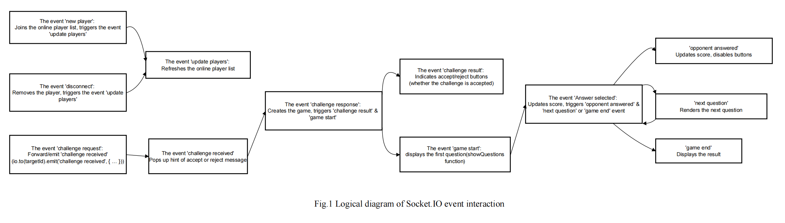

# personal-website-quiz-template

> A modern, interactive personal profile and real-time quiz web application

**GitHub:** [@Jackksonns](https://github.com/Jackksonns)

**Course Project Notice**  
This repository is the final project for University of Aberdeen JC2503 (2024-25): Web Application Development.
This repository evolves from the original course final project implementation.

**课程项目说明**  
本仓库为 University of Aberdeen JC2503 (2024-25): Web Application Development 课程大作业。（可复用模板在课程大作业的基础上迭代而成）


**Disclaimer (English)**  
This repository is provided for learning and academic exchange only. If you build upon or iterate on this repository, you must clearly cite this repository and mention it in your technical documentation. The developer is not responsible for any academic misconduct, plagiarism, or policy violations that result from copying or reusing this code. Any consequences arising from misuse are solely the responsibility of the user.

**免责声明（中文）**  
本仓库仅用于学习交流与学术讨论。如基于本仓库进行迭代或二次开发，务必明确引用本仓库，并在技术文档中进行说明。因套用或复用本仓库代码导致的作业抄袭、学术不端或违反学校政策等行为，均与开发者无关，责任由使用者自行承担。

## Project Overview
personal-website-quiz-template is an open-source web application that combines a beautiful personal homepage, a detailed self-introduction, and a real-time online quiz game. It is designed for students, developers, and anyone who wants to showcase themselves and have fun with friends through knowledge challenges.

- **Personal Introduction**: Brief and detailed self-introduction pages.
- **Real-time Quiz Game**: Challenge online users in a fast-paced quiz battle.
- **Modern UI**: Responsive, mobile-friendly, and visually appealing.

## Features
- **Home Page**: Showcases education background and major courses.
- **About Me Page**: Deeper insight into academic interests, achievements, and personal growth.
- **Quiz Game**: Multiplayer, real-time quiz with live score updates and challenge system.
- **Socket.io Integration**: Real-time communication for seamless gameplay.
- **Express + EJS**: Server-side rendering and routing.
- **Responsive Design**: Works on both desktop and mobile devices.
- **Template Data Source**: Personal content loads from a single JSON file, making it easy to reuse the site as a template.

## System Architecture


This diagram summarizes the Socket.IO event flow for player presence, challenges, game start, answering, and final results.

## Template System
The personal pages (home, about, quiz header text) now read data from `public/profile.json`.
`public/profile.js` loads the JSON and updates the page at runtime. This keeps the original
page content as a safe fallback if the JSON fails to load.

## Personalize This Template
Update your personal info in one place and the pages will refresh automatically.

1. Edit `public/profile.json`
   - Name, education, major courses, overview, and about sections live here.
   - You can use `{name}` inside text fields to reuse your name.
2. Replace `public/photo.png` with your own photo (keep the same filename).
3. Optional: update the quiz header text in `public/profile.json` under `quiz`.
4. Start the server and refresh the pages.
5. If you want to customize quiz questions, edit the `questions` array in `views/welcomeQuiz.ejs` and `quiz.js` so they stay in sync.


## Tech Stack
- **Backend**: Node.js, Express, Socket.io
- **Frontend**: HTML, CSS (Bootstrap), EJS, JavaScript
- **Templating**: EJS
- **Real-time**: Socket.io

## Quick Start
1. **Clone the repository**
   ```bash
   git clone https://github.com/Jackksonns/personal-website-quiz-template.git
   cd personal-website-quiz-template
   ```
2. **Install dependencies**
   
   Make sure you have [Node.js](https://nodejs.org/) installed. Then install the required packages:
   ```bash
   npm install express ejs socket.io
   ```
   Or simply run:
   ```bash
   npm install
   ```
   (All dependencies are listed in package.json)
3. **Start the server**
   You can use either of the following commands:
   ```bash
   node quiz.js
   # or
   npm start
   ```
4. **Open your browser**
   Visit [http://localhost:8080](http://localhost:8080)

## Main Pages & Usage
- **/index.html**: Brief personal introduction
- **/about.html**: Detailed self-introduction
- **/welcomeQuiz**: Real-time quiz game (enter your name, challenge online users, answer questions, see live scores)


---
For any questions or suggestions, feel free to open an issue or contact the maintainer. 

